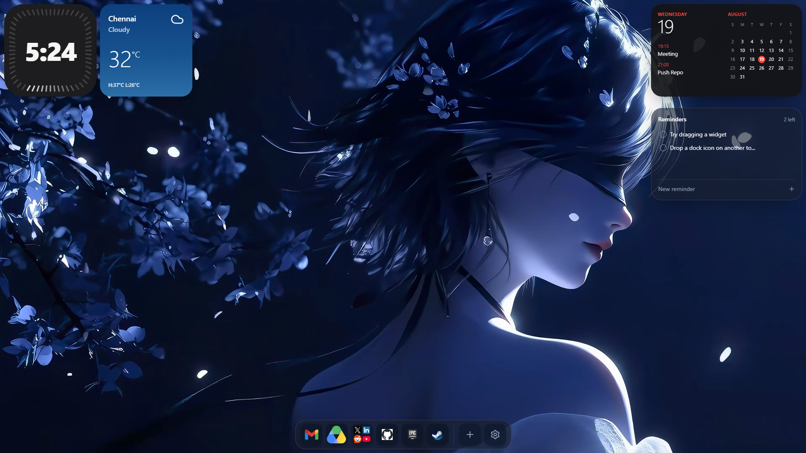

# macOS-style New Tab Chrome Extension

A Manifest V3 Chrome extension that replaces your new tab page with a macOS-like desktop: draggable widgets, a glass dock with folders, live wallpapers, and full customization. The same React desktop also runs as a live web demo on the landing page.



## Features

- **Desktop**
  - macOS-style gradient wallpapers (light/dark aware)
  - Custom image or video wallpaper from URL or local file
  - 10px safe margin so widgets and dock never touch the screen edge
  - Fully responsive from mobile to 4K ultrawide

- **Widgets** (draggable, with collision detection)
  - **Clock** — three Apple-style faces: Digital, Classic, Minimal
  - **Weather** — small square card or large forecast card (Open-Meteo, no API key)
  - **Calendar** — small month grid or large Apple-style UI with Google Calendar integration
  - **Reminders / To-Do** — square when empty, expands to a rectangle as you add tasks

- **Dock**
  - macOS-style glass dock with magnification hover effect
  - Add any web app by name + URL, with auto favicon
  - Drag to reorder apps and folders
  - Drop one icon onto another to create a folder
  - Open folders in a Launchpad-style grid
  - Right-click / long-press to rename or remove
  - Built-in settings gear icon

- **Settings**
  - Theme: system / light / dark
  - Wallpaper selection, custom image/video toggles
  - Widget visibility and positions
  - Weather units (°C / °F) and city
  - Clock style and 12/24-hour format
  - Google Calendar OAuth client ID
  - Backup / restore and reset to defaults

## Tech Stack

- [TanStack Start](https://tanstack.com/start) — full-stack React framework
- [React 19](https://react.dev)
- [TypeScript](https://www.typescriptlang.org)
- [Tailwind CSS v4](https://tailwindcss.com)
- [shadcn/ui](https://ui.shadcn.com)
- [Vite 7](https://vitejs.dev)
- Chrome Manifest V3

## Project Structure

```
├── extension/
│   ├── manifest.json          # Chrome extension manifest
│   ├── newtab.html            # Extension entry HTML
│   ├── newtab.tsx             # Extension entry React
│   ├── icon.png / icon48.png  # Extension icons
│   └── dist/                  # Built extension assets
├── public/
│   └── mac-home-extension.zip # Pre-built extension ZIP
├── src/
│   ├── components/desktop/    # Shared desktop components
│   ├── lib/desktop-storage.ts # chrome.storage.local + localStorage abstraction
│   ├── lib/google-calendar.ts # Google Calendar OAuth helpers
│   ├── routes/index.tsx       # Landing page
│   └── styles.css             # Design tokens + wallpaper gradients
├── vite.config.ts             # Web app build
└── vite.extension.config.ts   # Extension build
```

## Getting Started

### 1. Install dependencies

```bash
bun install
```

or with npm:

```bash
npm install
```

### 2. Run the web demo

```bash
bun run dev
```

Open `http://localhost:8080` to see the landing page with the live desktop demo.

## Building the Extension

Build the extension into `extension/dist/` and package it as `public/mac-home-extension.zip`:

```bash
bun run build:extension
bun run zip:extension
```

Or manually:

```bash
bunx vite build --config vite.extension.config.ts
cd extension && zip -r ../public/mac-home-extension.zip . -x "*.DS_Store"
```

> The final ZIP must have `manifest.json` and the icons at the root, with built assets in `dist/`.

## Loading the Extension in Chrome

1. Unzip `public/mac-home-extension.zip`.
2. Open Chrome and go to `chrome://extensions`.
3. Enable **Developer mode** (top right).
4. Click **Load unpacked** and select the unzipped `extension/` folder.
5. Open a new tab to see the desktop.

## Google Calendar Setup

Google Calendar sign-in only works inside the installed extension (it uses `chrome.identity`).

1. Enable the [Google Calendar API](https://console.cloud.google.com/apis/library/calendar-json.googleapis.com).
2. Go to **APIs & Services → OAuth consent screen** and set the user type to **External**. Add your Gmail as a test user.
3. Go to **Credentials → Create Credentials → OAuth client ID → Web application**.
4. Add the redirect URI shown in the extension's **Settings → Calendar** panel (copy it with the copy button).
5. Paste the client ID into the same settings field.
6. Click **Connect Google Calendar** on the calendar widget.

> The redirect URI looks like `https://<extension-id>.chromiumapp.org/gcal`. It is auto-detected from the running extension.

## Customizing the Landing Page

The landing page is `src/routes/index.tsx`. Edit that file to change the hero, feature sections, install steps, FAQ, or download buttons.

## Customizing the Desktop

All shared desktop components live in `src/components/desktop/`. Storage logic is in `src/lib/desktop-storage.ts`. Design tokens and wallpaper gradients are in `src/styles.css`.

## Troubleshooting

| Problem | Fix |
|---------|-----|
| `redirect_uri_mismatch` | Add the exact redirect URI from Settings → Calendar to your Google Cloud Web application client. |
| `403 org_internal` | Set the OAuth consent screen user type to **External** and add your email as a test user. |
| Wallpaper disappears on refresh | Large data URLs are now stored in IndexedDB. Re-pick the image/video once to migrate. |
| Extension icon error | Make sure `manifest.json` and `icon.png` / `icon48.png` are at the root of the unpacked folder. |

## License

MIT — feel free to fork, modify, and publish your own version.
